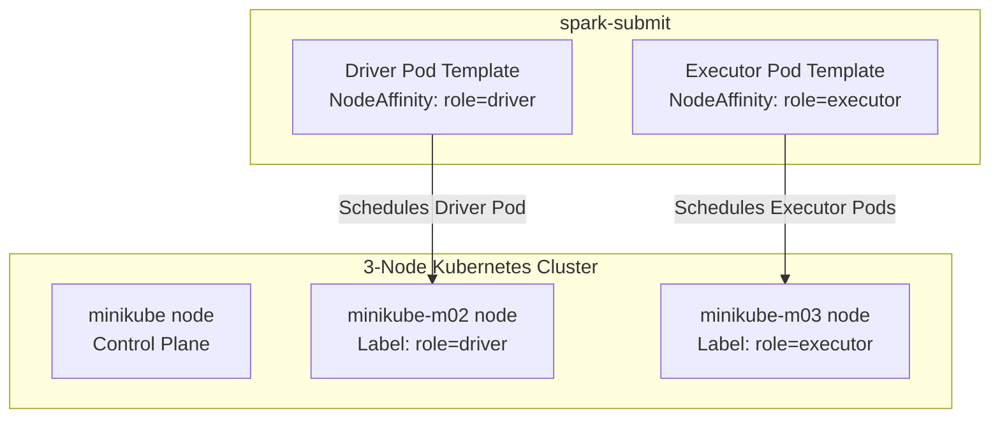

# Lab Guide: Scheduling Spark Workloads on Multi-Node Kubernetes using Node Affinity

This step-by-step guide walks you through deploying a multi-node local **Minikube** cluster, labeling nodes for dedicated workloads, and using Kubernetes **Node Affinity** and **Node Selectors** to schedule Spark driver and executor pods on different physical machines.

## Learning Objectives
*   Configure a multi-node Kubernetes cluster locally using Minikube.
*   Manage node labels using `kubectl label`.
*   Apply hard constraints (`requiredDuringSchedulingIgnoredDuringExecution`) via Node Affinity.
*   Utilize Spark pod template files to inject advanced Kubernetes specifications.
*   Verify pod scheduling using detailed output filters.

---

## Architectural Workflow

This lab demonstrates how Kubernetes schedules Spark components based on labels:



---

## Lab Directory Structure

All files for this lab are located in the `spark_minikube_affinity_lab/` directory:

```
spark_minikube_affinity_lab/
└── manifests/
    ├── spark-driver-template.yaml
    └── spark-executor-template.yaml
```

---

## Step 1: Start a 3-Node Minikube Cluster

By default, Minikube starts a single-node cluster. We will provision a 3-node cluster.

### 1.1 Start the Cluster
Open a PowerShell terminal on your Windows machine and run:
```powershell
# Stop and delete any existing single-node cluster to prevent conflicts
minikube delete

# Start a new 3-node cluster
minikube start --nodes 3
```

### 1.2 Inspect Active Nodes
Verify that 3 nodes have joined the cluster:
```powershell
kubectl get nodes
```

You should see an output resembling:
```
NAME           STATUS   ROLES           AGE   VERSION
minikube       Ready    control-plane   1m    v1.29.0
minikube-m02   Ready    <none>          45s   v1.29.0
minikube-m03   Ready    <none>          30s   v1.29.0
```

---

## Step 2: Assign Labels to Nodes

Labels are key-value pairs attached to Kubernetes objects (like nodes). We will dedicate `minikube-m02` to host Spark Drivers, and `minikube-m03` to host Spark Executors.

### 2.1 Label the Driver Node
```powershell
kubectl label nodes minikube-m02 role=driver
```

### 2.2 Label the Executor Node
```powershell
kubectl label nodes minikube-m03 role=executor
```

### 2.3 Verify Node Labels
Check that the labels have been applied successfully:
```powershell
# Get nodes showing the "role" label column
kubectl get nodes -L role
```

Output:
```
NAME           STATUS   ROLES           AGE    VERSION   ROLE
minikube       Ready    control-plane   3m     v1.29.0   
minikube-m02   Ready    <none>          2m     v1.29.0   driver
minikube-m03   Ready    <none>          100s   v1.29.0   executor
```

---

## Step 3: Configure Pod Templates

In Spark on Kubernetes, you can pass simple configuration key-values. However, for complex YAML definitions (such as Node Affinities, Volumes, or tolerations), you must use **Pod Template** files.

### 3.1 Explore Driver Pod Template
Open and inspect [manifests/spark-driver-template.yaml](file:///d:/trainings/aws_data_engineering/spark_minikube_affinity_lab/manifests/spark-driver-template.yaml).

```yaml
apiVersion: v1
kind: Pod
metadata:
  name: spark-driver-template
spec:
  affinity:
    nodeAffinity:
      requiredDuringSchedulingIgnoredDuringExecution:
        nodeSelectorTerms:
          - matchExpressions:
              - key: role
                operator: In
                values:
                  - driver
  containers:
    - name: spark-driver
      image: spark-container-demo:latest
```

*   **`requiredDuringSchedulingIgnoredDuringExecution`**: This is a **hard affinity** constraint. If Kubernetes cannot find a node with the label `role=driver`, the pod will remain in `Pending` state rather than scheduling on a generic node.

### 3.2 Explore Executor Pod Template
Open and inspect [manifests/spark-executor-template.yaml](file:///d:/trainings/aws_data_engineering/spark_minikube_affinity_lab/manifests/spark-executor-template.yaml).

```yaml
apiVersion: v1
kind: Pod
metadata:
  name: spark-executor-template
spec:
  affinity:
    nodeAffinity:
      requiredDuringSchedulingIgnoredDuringExecution:
        nodeSelectorTerms:
          - matchExpressions:
              - key: role
                operator: In
                values:
                  - executor
  containers:
    - name: spark-executor
      image: spark-container-demo:latest
```

---

## Step 4: Configure Cluster Permissions & Cache Image

### 4.1 Apply RBAC Settings
Spark pods require permissions to schedule executor pods. Create a basic RBAC configuration for Spark:

Create a file named `spark-rbac.yaml` and apply it:
```yaml
apiVersion: v1
kind: ServiceAccount
metadata:
  name: spark
  namespace: default
---
apiVersion: rbac.authorization.k8s.io/v1
kind: Role
metadata:
  name: spark-role
  namespace: default
rules:
  - apiGroups: [""]
    resources: ["pods", "services", "configmaps", "persistentvolumeclaims"]
    verbs: ["create", "get", "list", "watch", "delete", "deletecollection", "patch"]
  - apiGroups: [""]
    resources: ["pods/log"]
    verbs: ["get", "list"]
---
apiVersion: rbac.authorization.k8s.io/v1
kind: RoleBinding
metadata:
  name: spark-role-binding
  namespace: default
subjects:
  - kind: ServiceAccount
    name: spark
    namespace: default
roleRef:
  kind: Role
  name: spark-role
  apiGroup: rbac.authorization.k8s.io
```

Apply it:
```powershell
kubectl apply -f spark-rbac.yaml
```

### 4.2 Cache the Spark Docker Image
To run Spark, make sure your containerized Spark image (e.g. `spark-on-eks:latest` from your EKS lab) is cached inside Minikube. If you haven't built it inside Minikube's Docker daemon, load it manually:

```powershell
minikube image load spark-on-eks:latest
```

---

## Step 5: Submit Spark Job with Node Affinity

You will submit the Spark application using the pod template manifests. Spark parses these files and injects the affinity specs into the pods it creates.

### 5.1 Define K8s Master API Endpoint
Get the master endpoint URL:
```powershell
$K8S_MASTER = (kubectl config view --minify -o jsonpath='{.clusters[0].cluster.server}')
echo "K8s Master Endpoint: $K8S_MASTER"
```

### 5.2 Submit the Job
Execute `spark-submit` pointing to your local template files:

```powershell
# Navigate to where your Spark client binaries are unpacked (or run from CloudShell/PowerShell)
./bin/spark-submit `
  --master k8s://$K8S_MASTER `
  --deploy-mode cluster `
  --name spark-affinity-demo `
  --conf spark.kubernetes.container.image=spark-on-eks:latest `
  --conf spark.kubernetes.authenticate.driver.serviceAccountName=spark `
  --conf spark.executor.instances=2 `
  --conf spark.kubernetes.driver.podTemplateFile=d:\trainings\aws_data_engineering\spark_minikube_affinity_lab\manifests\spark-driver-template.yaml `
  --conf spark.kubernetes.executor.podTemplateFile=d:\trainings\aws_data_engineering\spark_minikube_affinity_lab\manifests\spark-executor-template.yaml `
  local:///opt/spark/work-dir/spark_app.py `
  local:///opt/spark/work-dir/sample_data.csv
```

---

## Step 6: Verify Scheduling (Affinity Validation)

While the job is running, run `kubectl` with the `-o wide` flag. This displays the assigned node IP and node name for each pod instance.

Run:
```powershell
kubectl get pods -o wide
```

Observe the output table, paying close attention to the **`NODE`** column:

```
NAME                             READY   STATUS    IP           NODE           NOMINATED NODE
spark-affinity-demo-driver       1/1     Running   10.244.1.2   minikube-m02   <none>
spark-affinity-demo-exec-1       1/1     Running   10.244.2.3   minikube-m03   <none>
spark-affinity-demo-exec-2       1/1     Running   10.244.2.4   minikube-m03   <none>
```

### Validation Check:
*   Did the driver pod (`spark-affinity-demo-driver`) run on **`minikube-m02`**? Yes!
*   Did the executor pods (`exec-1` and `exec-2`) run on **`minikube-m03`**? Yes!

This confirms that your Node Affinity and Node Labels are correctly configured and enforced by the Kubernetes Scheduler!

---

## Step 7: Teardown

To clean up resources and release CPU/Memory allocations on your host machine:

```powershell
# Delete the Spark pods
kubectl delete pod --all

# Stop Minikube VM nodes
minikube stop
```
