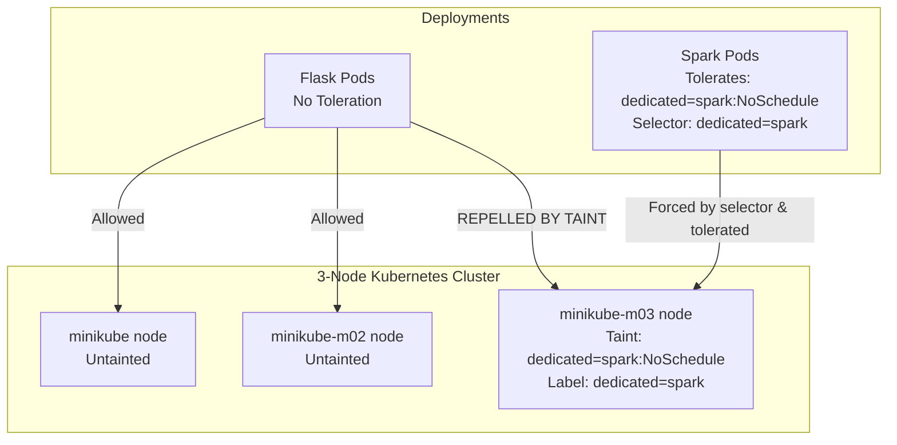

# Lab Guide: Securing Node Resources using Kubernetes Taints and Tolerations

This step-by-step guide walks you through configuring **Taints and Tolerations** on a local 3-node **Minikube** cluster. You will reserve a specific node (`minikube-m03`) for data engineering workloads (Apache Spark) and prevent general workloads (a Python Flask app) from scheduling on it.

## Learning Objectives
*   Understand the difference between Node Affinity (attracts pods) and Taints/Tolerations (repels pods).
*   Apply and inspect node taints using `kubectl taint` and `kubectl describe`.
*   Deploy a general workload and verify that the scheduler repels it from tainted nodes.
*   Configure Spark pod templates with matching tolerations to allow execution on reserved hardware.
*   Remove taints and labels to restore the default scheduling behavior.

---

## Architectural Workflow

The scheduling behavior is governed by node-level properties:



---

## Lab Directory Structure

All files for this lab are located in the `k8s_taint_toleration_lab/` directory:

```
k8s_taint_toleration_lab/
└── manifests/
    ├── flask-deployment.yaml
    ├── spark-driver-template.yaml
    └── spark-executor-template.yaml
```

---

## Step 1: Start the 3-Node Minikube Cluster

Start or restart a clean 3-node cluster:

```powershell
# Stop and delete any existing cluster to prevent resource conflicts
minikube delete

# Start a 3-node cluster
minikube start --nodes 3
```

Verify that all three nodes are healthy:
```powershell
kubectl get nodes
```

---

## Step 2: Taint and Label the Reserved Node (`minikube-m03`)

A **Taint** allows a node to repel a set of pods. It consists of a key, a value, and an effect.

### 2.1 Apply the Taint
Taint the third node `minikube-m03` with key `dedicated`, value `spark`, and effect `NoSchedule`:
```powershell
kubectl taint nodes minikube-m03 dedicated=spark:NoSchedule
```

*   **`NoSchedule`**: This effect means that if a pod does not tolerate this taint, Kubernetes will not schedule it onto this node. Existing running pods on the node are not evicted.

### 2.2 Apply the Label
While the taint repels other pods, we also need to label the node so our Spark pod templates can target it using a `nodeSelector`:
```powershell
kubectl label nodes minikube-m03 dedicated=spark
```

### 2.3 Verify Node Taint
Inspect `minikube-m03` to verify the taint:
```powershell
kubectl describe node minikube-m03
```
Look for the **`Taints:`** line in the output:
```
Taints:             dedicated=spark:NoSchedule
```

---

## Step 3: Deploy the Flask Application (Without Tolerations)

We will deploy our 3-replica Flask web application. Because the Flask deployment does not contain a toleration matching `dedicated=spark:NoSchedule`, it will be repelled by `minikube-m03`.

### 3.1 Examine the Flask Deployment
Open and inspect [manifests/flask-deployment.yaml](file:///d:/trainings/aws_data_engineering/k8s_taint_toleration_lab/manifests/flask-deployment.yaml).

Notice that there is no `tolerations` block under `spec.template.spec`.

### 3.2 Deploy the App
Ensure your Flask Docker image is cached in Minikube, then apply the manifest:
```powershell
minikube image load flask-container-demo:latest
kubectl apply -f manifests/flask-deployment.yaml
```

### 3.3 Verify Scheduling Placement
List all running pods and check which physical node they were scheduled on:
```powershell
kubectl get pods -o wide
```

Observe the **`NODE`** column:
```
NAME                                READY   STATUS    IP           NODE           
flask-deployment-64cbcf4b5f-5p89j   1/1     Running   10.244.0.4   minikube
flask-deployment-64cbcf4b5f-9k2lw   1/1     Running   10.244.1.3   minikube-m02
flask-deployment-64cbcf4b5f-xzz41   1/1     Running   10.244.1.4   minikube-m02
```

### Key Observation:
*   The Flask pods are scheduled on `minikube` and `minikube-m02`.
*   **None** of the Flask pods are scheduled on **`minikube-m03`**, confirming that the taint successfully repelled the general workload!

---

## Step 4: Submit Spark Job with Tolerations

To allow Spark driver and executor pods to run on the tainted node `minikube-m03`, we configure matching tolerations in their pod template manifests.

### 4.1 Examine the Pod Templates
Inspect the template files:
*   [manifests/spark-driver-template.yaml](file:///d:/trainings/aws_data_engineering/k8s_taint_toleration_lab/manifests/spark-driver-template.yaml)
*   [manifests/spark-executor-template.yaml](file:///d:/trainings/aws_data_engineering/k8s_taint_toleration_lab/manifests/spark-executor-template.yaml)

Both files contain the following `nodeSelector` and `tolerations` configuration:
```yaml
spec:
  nodeSelector:
    dedicated: spark
  tolerations:
    - key: "dedicated"
      operator: "Equal"
      value: "spark"
      effect: "NoSchedule"
```

*   **`tolerations`**: Tells the Kubernetes scheduler that these pods are allowed to run on a node with the `dedicated=spark:NoSchedule` taint.
*   **`nodeSelector`**: Directs the scheduler to specifically select nodes labeled `dedicated=spark` (forcing them to `minikube-m03`).

### 4.2 Configure Cluster RBAC
Make sure the `spark` ServiceAccount has appropriate cluster permissions (re-apply if needed):
```powershell
kubectl apply -f spark-rbac.yaml
```

Make sure the Spark image is cached across all nodes:
```powershell
minikube image load spark-on-eks:latest
```

### 4.3 Submit the Spark Job
Submit the job using the template files:

```powershell
$K8S_MASTER = (kubectl config view --minify -o jsonpath='{.clusters[0].cluster.server}')

./bin/spark-submit `
  --master k8s://$K8S_MASTER `
  --deploy-mode cluster `
  --name spark-taint-demo `
  --conf spark.kubernetes.container.image=spark-on-eks:latest `
  --conf spark.kubernetes.authenticate.driver.serviceAccountName=spark `
  --conf spark.executor.instances=2 `
  --conf spark.kubernetes.driver.podTemplateFile=d:\trainings\aws_data_engineering\k8s_taint_toleration_lab\manifests\spark-driver-template.yaml `
  --conf spark.kubernetes.executor.podTemplateFile=d:\trainings\aws_data_engineering\k8s_taint_toleration_lab\manifests\spark-executor-template.yaml `
  local:///opt/spark/work-dir/spark_app.py `
  local:///opt/spark/work-dir/sample_data.csv
```

---

## Step 5: Verify Node Partitioning

While the Spark job executes, inspect the node placement of all pods:

```powershell
kubectl get pods -o wide
```

Inspect the **`NODE`** column:
```
NAME                                READY   STATUS    IP           NODE           
flask-deployment-64cbcf4b5f-5p89j   1/1     Running   10.244.0.4   minikube
flask-deployment-64cbcf4b5f-9k2lw   1/1     Running   10.244.1.3   minikube-m02
flask-deployment-64cbcf4b5f-xzz41   1/1     Running   10.244.1.4   minikube-m02
spark-taint-demo-driver             1/1     Running   10.244.2.2   minikube-m03
spark-taint-demo-exec-1             1/1     Running   10.244.2.3   minikube-m03
spark-taint-demo-exec-2             1/1     Running   10.244.2.4   minikube-m03
```

### Analysis:
1.  **Flask Isolation**: Flask pods remain strictly on Node 1 (`minikube`) and Node 2 (`minikube-m02`). The taint keeps them off Node 3.
2.  **Spark Scheduling**: Spark driver and executor pods are scheduled successfully on Node 3 (`minikube-m03`) because their toleration matches the taint, and their nodeSelector targets the label.

---

## Step 6: Cleanup

To restore the default scheduling behavior of your cluster, clean up the manifests and remove the taints and labels:

### 6.1 Delete Deployments
```powershell
kubectl delete -f manifests/flask-deployment.yaml
kubectl delete pod --all
```

### 6.2 Remove Node Taint
To remove a taint, specify the key and append a trailing minus sign (`-`):
```powershell
kubectl taint nodes minikube-m03 dedicated:NoSchedule-
```

### 6.3 Remove Node Label
To remove a label, specify the key and append a trailing minus sign (`-`):
```powershell
kubectl label nodes minikube-m03 dedicated-
```

Verify that the node is clean:
```powershell
kubectl describe node minikube-m03
```

### 6.4 Stop Minikube
```powershell
minikube stop
```
