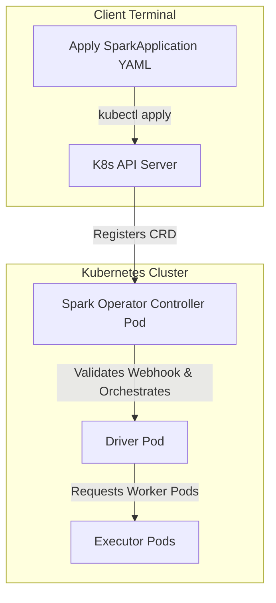

# Lab Guide: Running Spark Declaratively via Kubeflow Spark Operator

This step-by-step guide walks you through deploying the **Kubeflow Spark Operator** onto a local **Minikube** cluster using **Helm**, and managing Apache Spark jobs declaratively using custom Kubernetes resources (`SparkApplication`).

## Learning Objectives
*   Install **Helm** (Kubernetes package manager) on Windows.
*   Deploy the Spark Operator Controller and Mutating Webhook via Helm.
*   Understand the difference between command-line `spark-submit` and declarative Custom Resource Definitions (CRDs).
*   Deploy and monitor a `SparkApplication` custom resource.
*   Inspect logs from operator-managed driver pods.

---

## Architectural Workflow

The Spark Operator controller automates pod orchestration under the hood:



---

## Lab Directory Structure

All files for this lab are located in the `spark_operator_minikube_lab/` directory:

```
spark_operator_minikube_lab/
└── manifests/
    └── spark-application.yaml
```

---

## Step 1: Start Minikube & Install Helm

Helm is a package manager for Kubernetes that simplifies deploying complex third-party tools like the Spark Operator.

### 1.1 Start Minikube
Open a PowerShell terminal and run:
```powershell
minikube start
```

### 1.2 Install Helm on Windows
If you do not have Helm installed locally, you can install it using Windows Package Manager (`winget`) or Chocolatey:

```powershell
# Using winget
winget install Helm.Helm

# (Alternatively) using Chocolatey
# choco install kubernetes-helm
```

Restart your PowerShell terminal to update your PATH environment variable, then verify the installation:
```powershell
helm version
```

---

## Step 2: Deploy the Spark Operator via Helm

The Spark Operator runs as a controller pod in your cluster, listening for changes to `SparkApplication` resources and creating driver/executor pods automatically.

### 2.1 Add Helm Repository
Add the official Kubeflow Spark Operator Helm chart repository:
```powershell
helm repo add spark-operator https://kubeflow.github.io/spark-operator
helm repo update
```

### 2.2 Install the Operator
Install the chart into a dedicated namespace named `spark-operator`. We enable the mutating admission webhook to allow the operator to customize driver and executor pods dynamically:

```powershell
helm install my-release spark-operator/spark-operator `
  --namespace spark-operator `
  --create-namespace `
  --set webhook.enable=true
```

### 2.3 Verify Installation
Verify that the operator pod is running and the Custom Resource Definitions (CRDs) have been successfully registered:

```powershell
# Check operator pod status
kubectl get pods -n spark-operator

# Check registered CRDs (look for sparkoperator.k8s.io entries)
kubectl get crd | Select-String "spark"
```

---

## Step 3: Configure RBAC Permissions & Cache Image

The Spark driver pod spawned by the operator runs in the `default` namespace and requires permissions to orchestrate executor pods.

### 3.1 Apply RBAC Settings
If you haven't applied the `spark` service account configurations in your active namespace, apply them now:

```powershell
# Apply the spark-rbac.yaml we created in previous EKS / scheduling labs
kubectl apply -f spark-rbac.yaml
```

### 3.2 Cache the Spark Docker Image
Load the `spark-on-eks:latest` image (the image built in your EKS Spark lab) into Minikube's registry cache so it is available:

```powershell
minikube image load spark-on-eks:latest
```

---

## Step 4: Deploy the Spark Application Declaratively

Instead of building a long, error-prone `spark-submit` CLI command, you declare the entire Spark job configuration inside a clean YAML manifest.

### 4.1 Explore the Manifest
Open and inspect [manifests/spark-application.yaml](file:///d:/trainings/aws_data_engineering/spark_operator_minikube_lab/manifests/spark-application.yaml).

```yaml
apiVersion: "sparkoperator.k8s.io/v1beta2"
kind: SparkApplication
metadata:
  name: spark-operator-demo
  namespace: default
spec:
  type: Python
  pythonVersion: "3"
  mode: cluster
  image: "spark-on-eks:latest"
  imagePullPolicy: IfNotPresent
  mainApplicationFile: "local:///opt/spark/work-dir/spark_app.py"
  arguments:
    - "local:///opt/spark/work-dir/sample_data.csv"
  sparkVersion: "3.5.1"
  restartPolicy:
    type: Never
  driver:
    cores: 1
    coreLimit: "1200m"
    memory: "512m"
    labels:
      version: 3.5.1
    serviceAccount: spark
  executor:
    cores: 1
    instances: 1
    memory: "512m"
    labels:
      version: 3.5.1
```

### 4.2 Submit the Resource
Apply the manifest to the cluster:
```powershell
cd d:\trainings\aws_data_engineering\spark_operator_minikube_lab
kubectl apply -f manifests/spark-application.yaml
```

---

## Step 5: Monitor the Spark Job

Once the resource is created, the Spark Operator detects it and orchestrates the pods automatically.

### 5.1 Check Custom Resource Status
Query the status of your Spark application:
```powershell
kubectl get sparkapplications
```
*(Or use the shorthand: `kubectl get sparkapp`)*

Observe the `STATUS` column (it will cycle from `SUBMITTED` -> `RUNNING` -> `COMPLETED`).

### 5.2 View Pod Orchestration
List the active pods. You will see that the operator has spawned pods with deterministic names based on your metadata:
```powershell
kubectl get pods
```

You will see:
*   `spark-operator-demo-driver` (represents the driver process)
*   `spark-operator-demo-exec-1` (represents the executor node)

### 5.3 View Application Logs
Check the driver output logs to view execution details:
```powershell
# Stream logs from the driver pod
kubectl logs spark-operator-demo-driver -f
```

You will see the console aggregation tables printed from your PySpark script!

### 5.4 Describe the Application Resource
If a job fails, you can inspect the operator events for troubleshooting:
```powershell
kubectl describe sparkapp spark-operator-demo
```
Check the `Events:` block at the bottom of the output for detailed step-by-step logs.

---

## Step 6: Cleanup

To clean up the cluster and remove resources:

### 6.1 Delete the Spark Application
```powershell
kubectl delete -f manifests/spark-application.yaml
```
> [!TIP]
> Run `kubectl get pods`. Notice that the driver and executor pods are deleted automatically! The operator automatically performs garbage collection on all pods associated with the deleted custom resource.

### 6.2 Uninstall the Operator & Stop Minikube
```powershell
# Uninstall Spark Operator Helm chart
helm uninstall my-release -n spark-operator

# Stop Minikube
minikube stop
```
