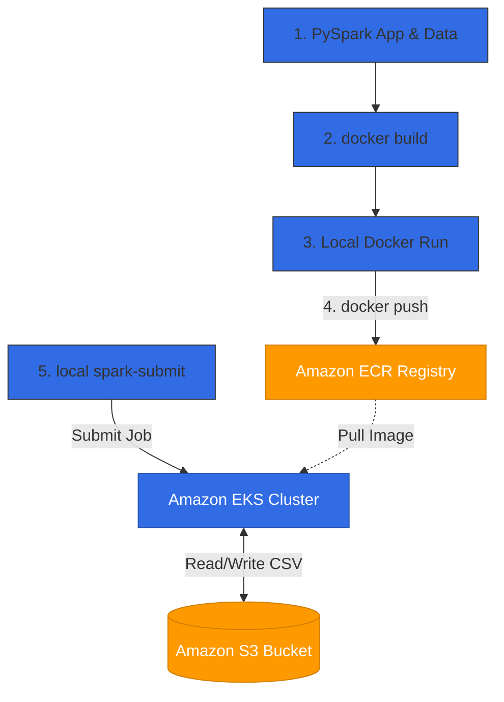

# Lab Guide: Containerize, Push, and Deploy Spark on Amazon EKS

This guide walks you through containerizing a PySpark application, pushing it to Amazon Elastic Container Registry (ECR), provisioning an Amazon EKS cluster, and submitting/running the Spark job on Kubernetes—**all executed manually via your terminal (e.g., zsh/bash console or VS Code / Visual Studio integrated terminal) on macOS**.

---

## 🛠️ Architectural Workflow & Environment Map

All commands in this lab are run from your local macOS development environment:



---

## 📋 Prerequisites

Verify the following tools are installed and configured on your machine:

| Tool | Purpose | Verification Command |
| :--- | :--- | :--- |
| **AWS CLI v2** | Authenticate & manage AWS resources | `aws sts get-caller-identity` |
| **Docker Desktop** | Build & run containers | `docker --version` |
| **kubectl** | Interact with Kubernetes cluster | `kubectl version --client` |
| **eksctl** | CLI for managing EKS clusters | `eksctl version` |
| **Java (OpenJDK 17)** | Required locally for `spark-submit` | `java -version` |

---

## 🔑 AWS CLI Configuration & Required Permissions

### AWS CLI Configuration
Before proceeding, configure your AWS CLI by running the following command in your terminal. You will be prompted to enter your AWS credentials:
```bash
aws configure
```
Provide the following values when prompted:
* 🔑 **AWS Access Key ID**: Your IAM User access key.
* 🔑 **AWS Secret Access Key**: Your IAM User secret access key.
* 🌐 **Default region name**: `us-west-2` (or your preferred AWS region).
* 📄 **Default output format**: `json`

### Required IAM Permissions
To complete this lab successfully, your IAM User must have permissions to create and manage the following AWS resources:
* **Amazon EKS**: Full cluster creation, node group management, and IAM OIDC provider registration permissions (e.g., `AmazonEKSClusterPolicy`, `AmazonEKSWorkerNodePolicy`).
* **Amazon ECR**: Permissions to create registries, login, tag, and push images (e.g., `AmazonEC2ContainerRegistryPowerUser`).
* **Amazon S3**: Permissions to create buckets and upload/download data (e.g., `AmazonS3FullAccess`).
* **AWS IAM**: Permissions to create IAM policies and roles (required by `eksctl` for setting up Service Accounts).

---

## 🐳 Part 1: Containerize the PySpark Application

### Step 1.1: Inspect the Project Files
Before building the container, review the core files:
* 📄 **PySpark Script**: [app/spark_app.py](app/spark_app.py) processes the transactions dataset.
* 📄 **Sample Data**: [app/sample_data.csv](app/sample_data.csv) contains transactional records.
* 📄 **Dockerfile**: [app/Dockerfile](app/Dockerfile) bundles Spark with necessary AWS S3 connectors.

### Step 1.2: Navigate to the Project Folder
Before running any commands, open your terminal and navigate to the `spark_on_eks` directory:
```bash
# Adjust path to where you cloned the repository
cd /path/to/aws_data_engineering/spark_on_eks
```

### Step 1.3: Build and Test Locally

1. **Build the Docker Image**:
   > [!IMPORTANT]
   > **Apple Silicon Mac users**: The EKS cluster in this lab defaults to using `m5.large` instances, which run on an Intel x86_64 architecture. To prevent execution failures on the cluster, you **MUST** force Docker to build using the `linux/amd64` platform:
   ```bash
   docker build --platform linux/amd64 -t spark-on-eks:latest -f app/Dockerfile app
   ```

2. **Run the Container (Test Run)**:
   You can run the container locally to verify Spark starts correctly:
   ```bash
   docker run --platform linux/amd64 --rm -it spark-on-eks:latest /opt/spark/bin/spark-submit /opt/spark/work-dir/spark_app.py /opt/spark/work-dir/sample_data.csv
   ```

> [!NOTE]
> Ensure the output displays the **"Aggregation results:"** table directly in the console.

---

## 📦 Part 2: Push Image to Amazon ECR

To deploy the image onto Amazon EKS, publish it to Amazon ECR.

### Step 2.1: Configure Environment Variables
Set your registry variables in the current terminal session:
```bash
export AWS_REGION="us-west-2"  # Set your target AWS region
export AWS_ACCOUNT_ID=$(aws sts get-caller-identity --query Account --output text)
export REGISTRY_URL="$AWS_ACCOUNT_ID.dkr.ecr.$AWS_REGION.amazonaws.com"
export ECR_IMAGE="$REGISTRY_URL/spark-on-eks:latest"

# Print variables to verify they are set correctly
echo $AWS_REGION
echo $AWS_ACCOUNT_ID
echo $REGISTRY_URL
echo $ECR_IMAGE
```

### Step 2.2: Create Repository & Authenticate
```bash
# Create ECR repository (safely ignore error if it already exists)
aws ecr create-repository --repository-name spark-on-eks --region $AWS_REGION --image-scanning-configuration scanOnPush=true

# Log in Docker to your ECR Registry
aws ecr get-login-password --region $AWS_REGION | docker login --username AWS --password-stdin $REGISTRY_URL
```

### Step 2.3: Tag and Push the Image
```bash
# Tag the local image
docker tag spark-on-eks:latest $ECR_IMAGE

# Push the image to Amazon ECR
docker push $ECR_IMAGE
```

---

## 🚀 Part 3: Deploy Spark on AWS EKS

### Step 3.1: Provision the EKS Cluster
1. Create the EKS cluster (takes 15–20 minutes). Configuration details are defined in [eks/eks_cluster.yaml](eks/eks_cluster.yaml):
   ```bash
   # Run from the spark_on_eks root folder
   eksctl create cluster -f eks/eks_cluster.yaml
   ```
2. Verify nodes are online:
   ```bash
   kubectl get nodes
   ```

### Step 3.2: Verify Spark Client Installation
Ensure you have set up the Apache Spark client and added its `bin` directory to your path as described in the [Environment Setup Guide](file:///d:/trainings/aws_data_engineering/setup/README.md).

1. **Verify Spark Version**:
   ```bash
   spark-submit --version
   ```
2. **Handle PySpark Environment Variables Warning**:
   > [!IMPORTANT]
   > **Do NOT run PySpark with `PYSPARK_PYTHON`** configured in your local terminal environment when submitting jobs to EKS. It will propagate to the cluster and crash your Spark jobs. Clear them temporarily in your current session:
   ```bash
   unset PYSPARK_PYTHON
   unset PYSPARK_DRIVER_PYTHON
   ```

> [!WARNING]
> **Java Version Incompatibility (`getSubject is not supported`)**:
> If you get a `java.lang.UnsupportedOperationException: getSubject is not supported` error, ensure your current terminal session is configured to use the correct JDK 17 path.
>
> **How to fix**: Force your current terminal session to use JDK 17:
> ```bash
> export JAVA_HOME=$(/usr/libexec/java_home -v 17)
> export PATH="$JAVA_HOME/bin:$PATH"
> ```

### Step 3.3: Configure Kubernetes RBAC
Spark needs permissions to launch driver and executor pods. Apply the RBAC rules relative to the root folder:
```bash
kubectl apply -f eks/spark-rbac.yaml
```

### Step 3.4: Submit Spark Job (Container CSV Mode)
Run the Spark job processing data stored locally inside the container image:

1. **Explore Kubernetes Configuration (Optional but Recommended)**:
   To inspect the connection configuration of your EKS cluster, view the current minified configuration:
   ```bash
   kubectl config view --minify
   ```
   *Take a moment to inspect the output. Under the `clusters` section, find the `server` field containing the Master API endpoint URL.*

2. **Retrieve the Kubernetes Master Endpoint**:
   Extract that specific `server` API endpoint URL and save it into a shell variable `K8S_MASTER`:
   ```bash
   export K8S_MASTER=$(kubectl config view --minify -o jsonpath='{.clusters[0].cluster.server}')
   
   # Print the variable to verify it is captured correctly
   echo $K8S_MASTER
   ```

3. **Submit the Job**:
   Submit the Spark job to the cluster. Since Spark is configured in your system `PATH`, you can run `spark-submit` directly from the `spark_on_eks` directory:
    ```bash
    spark-submit \
      --master k8s://$K8S_MASTER \
      --deploy-mode cluster \
      --name spark-on-eks-job \
      --conf spark.kubernetes.container.image=$ECR_IMAGE \
      --conf spark.kubernetes.authenticate.driver.serviceAccountName=spark \
      --conf spark.executor.instances=2 \
      --conf spark.kubernetes.driver.pod.name=spark-driver \
      --conf spark.kubernetes.driverEnv.PYSPARK_PYTHON=python3 \
      --conf spark.kubernetes.driverEnv.PYSPARK_DRIVER_PYTHON=python3 \
      --conf spark.executorEnv.PYSPARK_PYTHON=python3 \
      --conf spark.executorEnv.PYSPARK_DRIVER_PYTHON=python3 \
      local:///opt/spark/work-dir/spark_app.py \
      /opt/spark/work-dir/sample_data.csv
    ```

### Step 3.5: Monitor Execution
Check on the scheduler and download driver logs:
```bash
# Watch the pod creation status
kubectl get pods -w

# Get output logs of Spark driver pod
kubectl logs spark-driver
```

---

## 🧹 Clean Up Resources

To prevent recurring costs, clean up all provisioned AWS resources:
```bash
# Delete EKS cluster
eksctl delete cluster --name spark-eks-cluster

# Delete ECR repository
aws ecr delete-repository --repository-name spark-on-eks --force
```
