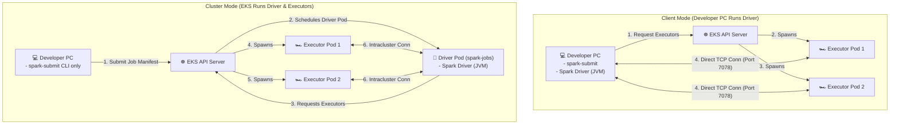

# Lab 4: Deploy Spark Workloads on EKS (Cluster Mode)

## 📖 Lab Overview
In this lab, you will transition from running Spark in **Client Mode** (where the driver process runs on your local machine) to **Cluster Mode** (where the driver process runs inside a Kubernetes pod on your Amazon EKS cluster).

Running in Cluster Mode is the industry standard for production environments because:
1. It eliminates the dependency on the developer's local machine network and JVM environment.
2. It allows EKS to schedule the driver and executor pods together close to the data, reducing network latency.
3. It optimizes compute utilization across EKS worker nodes.

### Architecture Comparison


---

## 📋 Prerequisites
Ensure you have completed the following setups before proceeding:
1. **Local environment configuration** (Java 17 and Apache Spark client installed and in your system `PATH`).
2. **ECR Image** containing S3 connector JARs pushed to your registry (completed in Lab 1 & 2).
3. **Active EKS Cluster** (e.g., `spark-eks-cluster-new`) running and configured with `kubectl`.

---

## 🛠️ Step-by-Step Implementation

### Step 1: Create Namespace and Configure RBAC
Spark driver pods must communicate with the Kubernetes API to orchestrate the lifecycle of their worker (executor) pods. To secure this deployment, we will create a dedicated namespace `spark-jobs` and map a least-privilege `Role` and `RoleBinding` config.

1. Create a configuration file named `spark-rbac.yaml` with the following content:
   ```yaml
   apiVersion: v1
   kind: Namespace
   metadata:
     name: spark-jobs
   ---
   apiVersion: v1
   kind: ServiceAccount
   metadata:
     name: spark-submit-sa
     namespace: spark-jobs
   ---
   apiVersion: rbac.authorization.k8s.io/v1
   kind: Role
   metadata:
     name: spark-executor-manager-role
     namespace: spark-jobs
   rules:
     - apiGroups: [""]
       resources: ["pods", "services", "configmaps", "persistentvolumeclaims"]
       verbs: ["create", "get", "list", "watch", "delete", "update"]
     - apiGroups: [""]
       resources: ["pods/log"]
       verbs: ["get", "list"]
   ---
   apiVersion: rbac.authorization.k8s.io/v1
   kind: RoleBinding
   metadata:
     name: spark-rbac-binding
     namespace: spark-jobs
   subjects:
     - kind: ServiceAccount
       name: spark-submit-sa
       namespace: spark-jobs
   roleRef:
     kind: Role
     name: spark-executor-manager-role
     apiGroup: rbac.authorization.k8s.io
   ```

2. Apply the configuration using `kubectl`:
   ```powershell
   kubectl apply -f spark-rbac.yaml
   ```

3. Verify that the ServiceAccount permissions are correctly restricted:
   ```powershell
   # This should return "yes"
   kubectl auth can-i create pods --as=system:serviceaccount:spark-jobs:spark-submit-sa -n spark-jobs

   # This should return "no" (ensuring namespace isolation)
   kubectl auth can-i create pods --as=system:serviceaccount:spark-jobs:spark-submit-sa -n default
   ```

---

### Step 2: Identify Worker Node Group Labels
In production clusters, we must prevent analytical workloads from running on EKS system node groups (which host DNS and control plane monitoring tools). 

1. Retrieve the node labels in your cluster to identify the target node group:
   ```powershell
   kubectl get nodes --show-labels
   ```

2. Note the label representing your worker nodes. For standard EKS node groups managed via `eksctl`, this is typically:
   `eks.amazonaws.com/nodegroup=spark-node-group`

---

### Step 3: Write the Job Submission Script
To handle the complexity of EKS authentication and passing JSON resource configurations, we will write a PowerShell script (`submit_cluster_mode.ps1`) to orchestrate the submission.

Create a file named `submit_cluster_mode.ps1` with the following content:

```powershell
# ==============================================================================
# LAB 4: SUBMISSION SCRIPT
# ==============================================================================

# 1. Verify Java Version (Must be JDK 17 / JDK 11. JDK 21+ will fail)
$JAVA_VER = & java -version 2>&1
if ($JAVA_VER -match "openjdk version `"2[0-9]") {
    Write-Warning "Detected incompatible Java 21+. Forcing session to JDK 17..."
    # Adjust this path to match your actual local JDK 17 installation directory:
    $env:JAVA_HOME = "C:\Program Files\Eclipse Adoptium\jdk-17.0.11.9-hotspot"
    $env:PATH = "$env:JAVA_HOME\bin;$env:PATH"
}

# 2. Configure target variables (Modify registry and cluster values as needed)
$AWS_REGION = "us-west-2"
$AWS_ACCOUNT_ID = (aws sts get-caller-identity --query Account --output text)
$CLUSTER_NAME = "spark-eks-cluster-new"
$S3_BUCKET = "spark-on-eks-220161" # Replace with your target S3 bucket

$REGISTRY_URL = "${AWS_ACCOUNT_ID}.dkr.ecr.${AWS_REGION}.amazonaws.com"
$ECR_IMAGE = "${REGISTRY_URL}/spark-on-eks:latest"

# 3. Retrieve Kubernetes API Master Endpoint
$K8S_MASTER = (kubectl config view --minify -o jsonpath='{.clusters[0].cluster.server}')
Write-Host "K8s Master Endpoint: $K8S_MASTER" -ForegroundColor Green

# 4. Submit the Spark job in Cluster Mode
spark-submit `
  --master "k8s://$K8S_MASTER" `
  --deploy-mode cluster `
  --name spark-eks-cluster-job `
  --namespace spark-jobs `
  --conf spark.kubernetes.container.image=$ECR_IMAGE `
  --conf spark.kubernetes.authenticate.driver.serviceAccountName=spark-submit-sa `
  --conf spark.executor.instances=2 `
  --conf spark.kubernetes.driver.pod.name=spark-driver `
  --conf spark.kubernetes.driverEnv.PYSPARK_PYTHON=python3 `
  --conf spark.executorEnv.PYSPARK_PYTHON=python3 `
  --conf spark.driver.cores=1 `
  --conf spark.kubernetes.driver.request.cores=0.5 `
  --conf spark.driver.memory=1024m `
  --conf spark.executor.cores=1 `
  --conf spark.kubernetes.executor.request.cores=0.5 `
  --conf spark.executor.memory=1433m `
  --conf spark.kubernetes.node.selector.eks.amazonaws.com/nodegroup=spark-node-group `
  "local:///opt/spark/work-dir/spark_app.py" `
  "s3://$S3_BUCKET/app/sample_data.csv" `
  "s3://$S3_BUCKET/spark-output-eks"
```

---

### Step 4: Submit and Monitor the Workload

1. Run the submission script:
   ```powershell
   ./submit_cluster_mode.ps1
   ```
   *Note: Since the deploy mode is `cluster`, the terminal will submit the manifest to the API and terminate. It will not stream logs here.*

2. Track pod creation and status inside the namespace:
   ```powershell
   kubectl get pods -n spark-jobs -w
   ```
   *Expected Output Lifecycle:*
   *   `spark-driver` changes from `Pending` -> `ContainerCreating` -> `Running`.
   *   Two executor pods (`spark-eks-cluster-job-...-exec-1` and `-exec-2`) will spawn, transition to `Running`, and complete their tasks.
   *   Once complete, the `spark-driver` transitions to `Completed`, and the executor pods terminate.

3. Extract logs from the driver pod to verify output results:
   ```powershell
   kubectl logs spark-driver -n spark-jobs
   ```
   Inspect the log lines. You should see Spark's SQL logging output along with the printed sales aggregation table.

---

## 🔍 Validation Checklist

| Action | Command / Query | Expected Output | Status |
| :--- | :--- | :--- | :---: |
| Verify Driver Pod | `kubectl get pods -n spark-jobs` | `spark-driver` pod in `Completed` state | ⬜ |
| Verify Executor Pods | `kubectl get pods -n spark-jobs -a` | Executor pods terminated after completion | ⬜ |
| Verify Logs | `kubectl logs spark-driver -n spark-jobs` | Spark aggregation metrics table shown | ⬜ |
| Check S3 Outputs | `aws s3 ls s3://<S3_BUCKET>/spark-output-eks/` | Output directory contains CSV/Parquet files | ⬜ |

---

## ❌ Troubleshooting & Common Errors

### 1. Pods Remain in `Pending` State with `Insufficient cpu`
*   **Cause:** EKS cluster does not have enough unallocated CPU cores to schedule the driver (1 CPU) or executors (1 CPU each) alongside existing systems.
*   **Fix:** Scale up the Node Group to add another node:
    ```powershell
    eksctl scale nodegroup --cluster spark-eks-cluster-new --name spark-node-group --nodes 2 --nodes-min 1 --nodes-max 3
    ```

### 2. Driver Pod Fails to Create with `ErrImagePull`
*   **Cause:** The EKS cluster nodes do not have permission to pull images from your ECR repository, or the registry login token has expired.
*   **Fix:** Ensure your EKS node instance profile contains `AmazonEC2ContainerRegistryReadOnly` policy permissions, or re-run `docker login` before building/pushing.

### 3. Execution Crashes with `Forbidden` / RBAC Errors
*   **Cause:** The Spark driver was submitted without specifying the service account, or the service account does not exist in the namespaces.
*   **Fix:** Verify that `--conf spark.kubernetes.authenticate.driver.serviceAccountName=spark-submit-sa` is spelled correctly and the RBAC YAML was applied in the `spark-jobs` namespace.
