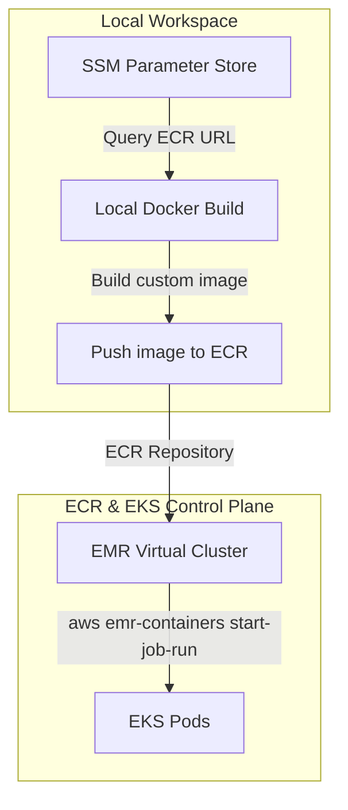

# Lab Guide: Running Spark Workloads via Amazon EMR on EKS (Cross-Platform Version)

This step-by-step guide walks you through deploying containerized PySpark applications using **Amazon EMR on EKS**. You will query **AWS Systems Manager (SSM) Parameter Store** to discover the Amazon Elastic Container Registry (ECR) repository, build a custom EMR runtime container image, push it to ECR, and execute a Spark job targeting your EMR Virtual Cluster.

This guide provides instructions optimized for **Windows (PowerShell)** and **macOS / Linux (Bash/Zsh)**.

---

## Architectural Workflow

The EMR on EKS orchestration operates as follows:



---

## Lab Directory Structure

All files for this lab are located in the `spark_on_emr_eks_new/` directory:

```
spark_on_emr_eks_new/
├── app/
│   ├── Dockerfile
│   ├── spark_app.py
│   └── sample_data.csv
└── LAB_GUIDE.md
```

## AWS CLI Authentication Prerequisite

> [!WARNING]
> If you receive an error like `UnrecognizedClientException: The security token included in the request is invalid` when running AWS CLI commands, it means your AWS CLI is not authenticated or your session token has expired.
> 
> You must authenticate your terminal session before proceeding:
> *   **If you have standard IAM credentials**: Run `aws configure` and enter your `AWS Access Key ID` and `AWS Secret Access Key`.
> *   **If you are using temporary session tokens (e.g., AWS Academy, Sandbox, or IAM Session Role)**: Export the temporary environment variables in your active terminal:
>     *   **Windows (PowerShell)**:
>         ```powershell
>         $env:AWS_ACCESS_KEY_ID="ASIA..."
>         $env:AWS_SECRET_ACCESS_KEY="xxxx..."
>         $env:AWS_SESSION_TOKEN="FwoG..."
>         ```
>     *   **macOS / Linux (Bash/Zsh)**:
>         ```bash
>         export AWS_ACCESS_KEY_ID="ASIA..."
>         export AWS_SECRET_ACCESS_KEY="xxxx..."
>         export AWS_SESSION_TOKEN="FwoG..."
>         ```
> *   **If you use AWS IAM Identity Center (SSO)**: Run `aws sso login` to sign in.

---

## Step 1: Query SSM Parameter Store for the ECR Repository URL

Rather than hardcoding resources, cloud platforms use SSM Parameter Store to share variables. We will fetch the pre-created ECR Repository URL.

### 1.1 Execute CLI Query
Open your terminal and run the query corresponding to your operating system:

#### Windows (PowerShell)
```powershell
# Query SSM Parameter and store in a PowerShell variable
$ECR_REPO_URL = (aws ssm get-parameter --name "/platform/dev/ecr_repository_url" --query "Parameter.Value" --output text)

# Print the value to verify
Write-Host "ECR Repo URL: $ECR_REPO_URL"
```

#### macOS / Linux (Bash/Zsh)
```bash
# Query SSM Parameter and store in a Shell variable
ECR_REPO_URL=$(aws ssm get-parameter --name "/platform/dev/ecr_repository_url" --query "Parameter.Value" --output text)

# Print the value to verify
echo "ECR Repo URL: $ECR_REPO_URL"
```

Ensure the output prints your ECR registry path (e.g. `<aws_account_id>.dkr.ecr.<region>.amazonaws.com/<repo_name>`).

---

## Step 2: Build the Custom EMR Runtime Image

EMR on EKS allows you to package dependencies, custom JAR files, or application scripts directly into the container image using EMR base runtimes.

### 2.1 Explore the Dockerfile
Open and inspect [app/Dockerfile](file:///d:/trainings/aws_data_engineering/spark_on_emr_eks_new/app/Dockerfile).

```dockerfile
# Start from the official EMR on EKS base runtime image (version 6.10.0)
FROM public.ecr.aws/emr-on-eks/spark/emr-6.10.0:latest

# Switch to root to perform file administration operations
USER root

# Create work-dir structure
RUN mkdir -p /opt/spark/work-dir

# Copy application script and CSV dataset
COPY spark_app.py /opt/spark/work-dir/spark_app.py
COPY sample_data.csv /opt/spark/work-dir/sample_data.csv

# Assign permissions back to the default EMR container user (hadoop)
RUN chown -R hadoop:hadoop /opt/spark/work-dir

# Switch back to the non-root execution user
USER hadoop

# Set workdir
WORKDIR /opt/spark/work-dir
```

> [!NOTE]
> The base image is retrieved from the AWS Public ECR repository. For EMR runtime containers, the default non-root execution user is **`hadoop`** (UID 1000).

### 2.2 Compile the Docker Image
Navigate to the `app/` folder and build the image:

#### Windows (PowerShell)
```powershell
cd d:\trainings\aws_data_engineering\spark_on_emr_eks_new\app
docker build -t spark-emr-eks:latest .
```

#### macOS / Linux (Bash/Zsh)
```bash
cd d:/trainings/aws_data_engineering/spark_on_emr_eks_new/app
docker build -t spark-emr-eks:latest .
```

---

## Step 3: Login and Push the Image to ECR

### 3.1 Authenticate Docker CLI to ECR
To push images to ECR, your local Docker daemon must authenticate to the ECR registry.

#### Windows (PowerShell)
```powershell
# Parse ECR registry base domain and AWS region
$RegistryUrl = $ECR_REPO_URL.Split("/")[0]
$AwsRegion = $ECR_REPO_URL.Split(".")[3]

# Run the get-login-password pipeline
aws ecr get-login-password --region $AwsRegion | docker login --username AWS --password-stdin $RegistryUrl
```

#### macOS / Linux (Bash/Zsh)
```bash
# Parse ECR registry base domain and AWS region
RegistryUrl=$(echo $ECR_REPO_URL | cut -d'/' -f1)
AwsRegion=$(echo $ECR_REPO_URL | cut -d'.' -f4)

# Run the get-login-password pipeline
aws ecr get-login-password --region $AwsRegion | docker login --username AWS --password-stdin $RegistryUrl
```

Confirm that you receive `Login Succeeded` in your console.

### 3.2 Tag and Push the Image
Tag the local image with the remote ECR repository path and push it:

#### Windows (PowerShell)
```powershell
docker tag spark-emr-eks:latest "$ECR_REPO_URL:latest"
docker push "$ECR_REPO_URL:latest"
```

#### macOS / Linux (Bash/Zsh)
```bash
docker tag spark-emr-eks:latest "$ECR_REPO_URL:latest"
docker push "$ECR_REPO_URL:latest"
```

---

## Step 4: Discover EMR Cluster & Job Execution Role

Before submitting the job, we need to locate the existing EMR Virtual Cluster ID and the IAM role used to run the container jobs.

### 4.1 Retrieve Virtual Cluster ID
Find the running EMR virtual cluster:

#### Windows (PowerShell)
```powershell
$VIRTUAL_CLUSTER_ID = (aws emr-containers list-virtual-clusters --query "virtualClusters[?state=='RUNNING'].id" --output text)
Write-Host "Virtual Cluster ID: $VIRTUAL_CLUSTER_ID"
```

#### macOS / Linux (Bash/Zsh)
```bash
VIRTUAL_CLUSTER_ID=$(aws emr-containers list-virtual-clusters --query "virtualClusters[?state=='RUNNING'].id" --output text)
echo "Virtual Cluster ID: $VIRTUAL_CLUSTER_ID"
```

### 4.2 Retrieve Execution Role ARN
Retrieve the IAM Execution Role (typically contains `EMRJobExecution` in its name):

#### Windows (PowerShell)
```powershell
$EXECUTION_ROLE_ARN = (aws iam list-roles --query "Roles[?contains(RoleName, 'EMRJobExecution')].Arn" --output text)
Write-Host "Execution Role ARN: $EXECUTION_ROLE_ARN"
```

#### macOS / Linux (Bash/Zsh)
```bash
EXECUTION_ROLE_ARN=$(aws iam list-roles --query "Roles[?contains(RoleName, 'EMRJobExecution')].Arn" --output text)
echo "Execution Role ARN: $EXECUTION_ROLE_ARN"
```

---

## Step 5: Execute the Spark Job on EMR on EKS

Now submit the job run. The command mounts your custom container image and triggers `spark-submit` internally within EMR.

*   *Note: In Windows PowerShell, multi-line commands use the backtick (`` ` ``) for line continuation. In macOS / Linux, they use the backslash (`\`). Double quotes must also be escaped differently depending on the shell environment.*

#### Windows (PowerShell)
```powershell
aws emr-containers start-job-run `
  --virtual-cluster-id $VIRTUAL_CLUSTER_ID `
  --name "spark-emr-eks-job" `
  --execution-role-arn $EXECUTION_ROLE_ARN `
  --release-label "emr-6.10.0-latest" `
  --job-driver "{
    `"sparkSubmitJobDriver`": {
      `"entryPoint`": `"local:///opt/spark/work-dir/spark_app.py`",
      `"entryPointArguments`": [`"local:///opt/spark/work-dir/sample_data.csv`"],
      `"sparkSubmitParameters`": `"--conf spark.kubernetes.container.image=$ECR_REPO_URL:latest --conf spark.executor.instances=2`"
    }
  }"
```

#### macOS / Linux (Bash/Zsh)
```bash
aws emr-containers start-job-run \
  --virtual-cluster-id $VIRTUAL_CLUSTER_ID \
  --name "spark-emr-eks-job" \
  --execution-role-arn $EXECUTION_ROLE_ARN \
  --release-label "emr-6.10.0-latest" \
  --job-driver '{
    "sparkSubmitJobDriver": {
      "entryPoint": "local:///opt/spark/work-dir/spark_app.py",
      "entryPointArguments": ["local:///opt/spark/work-dir/sample_data.csv"],
      "sparkSubmitParameters": "--conf spark.kubernetes.container.image='"$ECR_REPO_URL"':latest --conf spark.executor.instances=2"
    }
  }'
```

Ensure the command returns the Job ID and Arn successfully:
```json
{
    "id": "000000030c25a1abcde",
    "name": "spark-emr-eks-job",
    "arn": "arn:aws:emr-containers:us-east-1:123456789012:/virtualclusters/.../jobruns/...",
    "virtualClusterId": "..."
}
```

---

## Step 6: Monitor the Job Status

To track your job execution status:

### 6.1 Check Job Status via CLI
Query details of the specific job run ID:

#### Windows (PowerShell)
```powershell
# Replace with the Job ID returned in the previous step
$JOB_ID = "000000030c25a1abcde"
aws emr-containers describe-job-run --virtual-cluster-id $VIRTUAL_CLUSTER_ID --id $JOB_ID
```

#### macOS / Linux (Bash/Zsh)
```bash
# Replace with the Job ID returned in the previous step
JOB_ID="000000030c25a1abcde"
aws emr-containers describe-job-run --virtual-cluster-id $VIRTUAL_CLUSTER_ID --id $JOB_ID
```

Look for the **`"state"`** field (e.g. `PENDING`, `SUBMITTED`, `RUNNING`, `COMPLETED`).

### 6.2 View Pods on the EKS Cluster
If you have `kubectl` configured to connect to your EKS cluster, you can see the EMR-managed driver and executor pods:

#### Windows (PowerShell) & macOS / Linux
```bash
kubectl get pods -n <emr_namespace>
```
*(EMR Virtual Clusters run within a designated namespace on your EKS cluster).*
