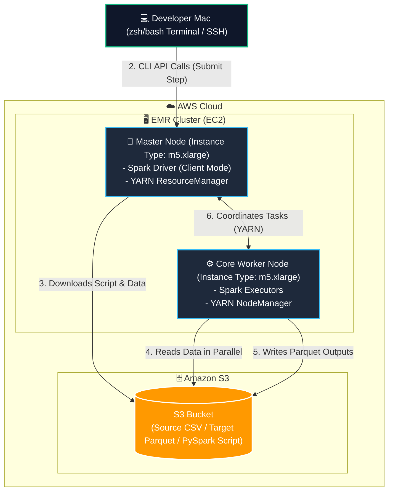

# Lab Guide: Apache Spark on Amazon EMR

This lab guide walks you through setting up, deploying, and executing Apache Spark applications on **Amazon EMR (Elastic MapReduce)**. You will run a PySpark job in both batch mode (using EMR Steps) and interactive mode (via SSH) using macOS.

---

## 🏗️ Architecture Overview

The following diagram illustrates the deployment and data flow of Spark on an EMR cluster:



---

## 📊 Prerequisites & S3 Setup

Before launching the EMR cluster, you must set up your S3 bucket, upload application files, and ensure EMR default roles are present.

### Step 1.1: Navigate to the Project Folder
Open your terminal and navigate to the project directory:
```bash
cd /path/to/aws_data_engineering/spark_on_emr
```

### Step 1.2: Configure Environment Variables
Set your target region and bucket name:
```bash
export AWS_REGION="us-west-2"
export S3_BUCKET="spark-on-emr-$((100000 + RANDOM % 900000))"
echo "S3_BUCKET = $S3_BUCKET"
```

### Step 1.3: Create Bucket and Upload Files
Run the following commands to create your bucket and upload the PySpark app script and sample CSV data:
```bash
# Create S3 Bucket
aws s3 mb "s3://$S3_BUCKET" --region $AWS_REGION

# Upload application PySpark script
aws s3 cp app/spark_app.py "s3://$S3_BUCKET/app/spark_app.py"

# Upload sample CSV data
aws s3 cp app/sample_data.csv "s3://$S3_BUCKET/app/sample_data.csv"
```

### Step 1.4: Create EMR Default IAM Roles
Amazon EMR requires default service and EC2 instance profile roles to interact with AWS resources. Create them if they are not already present:
```bash
aws emr create-default-roles
```

### Step 1.5: Create an EC2 Key Pair for SSH Access
To SSH into the EMR master node later, create an EC2 key pair and save the private key locally:
```bash
export KEY_NAME="emr-spark-key"

# Ensure the .ssh directory exists
mkdir -p ~/.ssh

# Create key pair and save private key
aws ec2 create-key-pair \
    --key-name $KEY_NAME \
    --query "KeyMaterial" \
    --output text > ~/.ssh/$KEY_NAME.pem

# Set secure permissions (Required for SSH keys on macOS)
chmod 400 ~/.ssh/$KEY_NAME.pem
```

---

## 🚀 Part 2: Create EMR Cluster

Now, launch a 2-node EMR cluster (1 Master node, 1 Core worker node) running EMR 7.0.0 (which bundles Apache Spark 3.5.0).

### Step 2.1: Retrieve a Default Subnet ID
To launch the EMR cluster in your default VPC, retrieve a valid Subnet ID:
```bash
export SUBNET_ID=$(aws ec2 describe-subnets --query "Subnets[0].SubnetId" --output text)
echo "SUBNET_ID = $SUBNET_ID"
```

### Step 2.2: Launch the EMR Cluster
Execute the cluster creation command:
```bash
aws emr create-cluster \
    --name "spark-emr-cluster" \
    --release-label emr-7.0.0 \
    --applications Name=Spark \
    --ec2-attributes KeyName=$KEY_NAME,SubnetId=$SUBNET_ID \
    --use-default-roles \
    --instance-groups \
        InstanceGroupType=MASTER,InstanceCount=1,InstanceType=m5.xlarge \
        InstanceGroupType=CORE,InstanceCount=1,InstanceType=m5.xlarge \
    --region $AWS_REGION
```
*(The command output will print the Cluster ID, e.g., `"ClusterId": "j-2XXXXXXXXXXXX"`).*

### Step 2.3: Capture Cluster ID and Monitor Status
Save your Cluster ID to a variable and monitor the status until it shows `WAITING`:
```bash
export CLUSTER_ID="<YOUR_CLUSTER_ID>"   # Replace with the ClusterId from the previous output

# Check cluster status (Wait until it shows "State": "WAITING")
aws emr describe-cluster --cluster-id $CLUSTER_ID --query "Cluster.Status.State" --output text
```

---

## ⚡ Part 3: Submit Spark Job via EMR Steps (Batch Mode)

EMR Steps is the recommended way to submit batch Spark jobs without logging into nodes. The job will run automatically, and EMR will handle resource scheduling.

### Step 3.1: Submit the Step
Add a step to execute the PySpark script:
```bash
# Write the JSON step configuration to a temporary file
cat << EOF > steps.json
[
  {
    "Name": "SparkAggregationJob",
    "Type": "CUSTOM_JAR",
    "ActionOnFailure": "CONTINUE",
    "Jar": "command-runner.jar",
    "Args": [
      "spark-submit",
      "--deploy-mode",
      "cluster",
      "s3://$S3_BUCKET/app/spark_app.py",
      "s3://$S3_BUCKET/app/sample_data.csv",
      "s3://$S3_BUCKET/spark-output"
    ]
  }
]
EOF

# Submit the step to EMR using the file scheme
aws emr add-steps --cluster-id $CLUSTER_ID --steps file://steps.json

# Clean up the temporary file
rm steps.json
```
*(The command returns a StepId, e.g., `"StepIds": ["s-1XXXXXXXXXXXX"]`).*

### Step 3.2: Monitor Step Progress
Save the Step ID and track the execution status:
```bash
export STEP_ID="<YOUR_STEP_ID>"   # Replace with the StepId from the previous output

# Check step status (Wait until it shows "COMPLETED")
aws emr describe-step --cluster-id $CLUSTER_ID --step-id $STEP_ID --query "Step.Status.State" --output text
```

### Step 3.3: Verify Output in S3
Once completed, check S3 to confirm the Parquet output files were written:
```bash
aws s3 ls "s3://$S3_BUCKET/spark-output/"
```

### Step 3.4: Terminate the Cluster
Run the termination command:
```bash
aws emr terminate-clusters --cluster-ids $CLUSTER_ID
```

### Step 3.5: Verify Cluster Termination
Verify that the cluster state transitions to `TERMINATING` / `TERMINATED`:
```bash
aws emr describe-cluster --cluster-id $CLUSTER_ID --query "Cluster.Status.State" --output text
```

> [!CAUTION]
> **Important Financial Safety Note**:
> Always verify that EMR clusters are fully terminated after completing your labs. Leaving EMR Master and Core nodes running will continue to incur EC2 billing fees.
