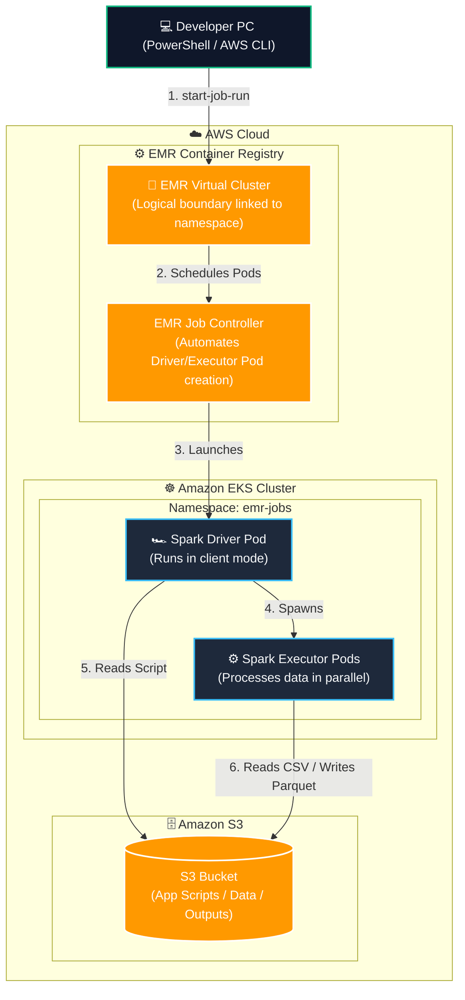

# Lab Guide: Apache Spark on Amazon EMR on EKS

This lab guide walks you through deploying and executing serverless Apache Spark applications on EKS using **Amazon EMR on Amazon EKS (EMR on EKS)**. You will configure EKS namespace access, map an EMR Virtual Cluster, set up a Job Execution Role, and submit jobs using the AWS CLI.

---

## 🏗️ Architecture Overview

The following diagram illustrates EMR on EKS deployment and execution workflow:



---

## 📊 Prerequisites & S3 Setup

We will configure our target variables, create the S3 bucket, and upload the application files.

### Step 1.1: Navigate to the Project Folder
Open your PowerShell terminal and navigate to the project directory:
```powershell
cd d:\trainings\aws_data_engineering\spark_on_emr_on_eks
```

### Step 1.2: Verify or Create EKS Cluster
EMR on EKS requires a running EKS cluster with OIDC integration enabled.

1. **Verify if you already have a running EKS cluster**:
   ```powershell
   eksctl get clusters
   ```
   If a cluster (like `spark-eks-cluster`) is already running and active, you can proceed to the next step.

2. **If you do NOT have a running EKS cluster**:
   You must provision one before starting. You can follow the cluster provisioning instructions in the [Apache Spark on Amazon EKS Guide](file:///d:/trainings/aws_data_engineering/spark_on_eks/LAB_GUIDE.md#step-31-provision-the-eks-cluster), or directly launch the cluster using the configuration file from that guide:
   ```powershell
   # Provision the cluster (takes 15–20 minutes) using the configuration in the spark_on_eks folder
   eksctl create cluster -f ../spark_on_eks/eks/eks_cluster.yaml
   ```

### Step 1.3: Configure Environment Variables
Define the regional variables, bucket name, and your active EKS cluster name:
```powershell
$AWS_REGION = "us-west-2"
$CLUSTER_NAME = "spark-eks-cluster"
$S3_BUCKET = "spark-emr-eks-" + (Get-Random -Minimum 100000 -Maximum 999999)
echo "S3_BUCKET = $S3_BUCKET"
```

### Step 1.4: Create Bucket and Upload Files
Run the following commands to create your bucket and upload the PySpark app script and sample CSV data:
```powershell
# Create S3 Bucket
aws s3 mb "s3://$S3_BUCKET" --region $AWS_REGION

# Upload application PySpark script
aws s3 cp app/spark_app.py "s3://$S3_BUCKET/app/spark_app.py"

# Upload sample CSV data
aws s3 cp app/sample_data.csv "s3://$S3_BUCKET/app/sample_data.csv"
```

---

## ☸️ Part 2: Prepare EKS Namespace & RBAC

EMR on EKS requires a dedicated namespace and Kubernetes RBAC permission to spawn Spark driver/executor pods.

### Step 2.1: Create Namespace
Create a namespace named `emr-jobs` in your cluster:
```powershell
kubectl create namespace emr-jobs
```

### Step 2.2: Apply RBAC Policy
Apply the pre-configured Role and RoleBinding from the repository. This permits the EMR on EKS service principal to manage resources in the namespace:
```powershell
kubectl apply -f eks/emr-rbac.yaml
```

---

## 🔑 Part 3: Create Job Execution IAM Role

Spark applications need an IAM Role (Job Execution Role) to access AWS resources (like S3 buckets or CloudWatch logs).

### Step 3.1: Create the Job Execution Role
To allow EMR on EKS to assume this execution role when launching pods on your EKS cluster, we will use a template-driven creation process. This approach retrieves the EKS cluster's OIDC issuer ID dynamically, injects it into a trust policy template ([eks/trust-policy-template.json](file:///d:/trainings/aws_data_engineering/spark_on_emr_on_eks/eks/trust-policy-template.json)), and creates the role in one step—fully compatible with restricted IAM sandbox users.

Run the following commands in your PowerShell console:
```powershell
# 1. Retrieve the required environment variables
$AWS_ACCOUNT_ID = (aws sts get-caller-identity --query Account --output text)
$OIDC_PROVIDER = (aws eks describe-cluster --name $CLUSTER_NAME --query "cluster.identity.oidc.issuer" --output text)
$OIDC_ID = $OIDC_PROVIDER.Split('/')[-1]

# 2. Read the trust policy template and substitute placeholders
$TRUST_POLICY = (Get-Content -Raw -Path eks/trust-policy-template.json) `
    -replace "<ACCOUNT_ID>", $AWS_ACCOUNT_ID `
    -replace "<REGION>", $AWS_REGION `
    -replace "<OIDC_ID>", $OIDC_ID

# 3. Write the JSON payload to a temporary file
[System.IO.File]::WriteAllText("$pwd/trust-policy.json", $TRUST_POLICY)

# 4. Create the IAM Role for EMR Job Execution
aws iam create-role `
    --role-name EMR_EKS_JobExecutionRole `
    --assume-role-policy-document file://trust-policy.json

# 5. Attach the S3 access policy to the role
aws iam attach-role-policy `
    --role-name EMR_EKS_JobExecutionRole `
    --policy-arn arn:aws:iam::aws:policy/AmazonS3FullAccess

# 6. Clean up the temporary file
Remove-Item -Path trust-policy.json
```


---

## 📁 Part 4: Register EMR Virtual Cluster

An EMR Virtual Cluster is a logical entity mapping EMR Containers to a specific Kubernetes namespace inside your EKS cluster.

> [!IMPORTANT]
> **Required IAM Permissions:**
> To register and manage EMR Virtual Clusters, your active AWS IAM identity must have permissions for the following actions:
> * `emr-containers:CreateVirtualCluster`
> * `emr-containers:ListVirtualClusters`
> * `emr-containers:DescribeVirtualCluster`
> 
> If you encounter an `AccessDeniedException` when executing the register command below, request your AWS Administrator to grant these permissions (e.g., by attaching the standard **`AmazonEMRContainersServiceRolePolicy`** policy).

### Step 4.1: Register the Virtual Cluster
Run the CLI command to create the virtual cluster mapping to the `emr-jobs` namespace:
# 1. Define the container provider JSON in a PowerShell Here-String
$PROVIDER = @"
{
  "id": "$CLUSTER_NAME",
  "type": "EKS",
  "info": {
    "eksInfo": {
      "namespace": "emr-jobs"
    }
  }
}
"@

# 2. Write the JSON to a temporary file (using .NET API to prevent UTF-8 BOM encoding issues)
[System.IO.File]::WriteAllText("$pwd/provider.json", $PROVIDER)

# 3. Create the EMR Virtual Cluster
aws emr-containers create-virtual-cluster `
    --name emr-eks-virtual-cluster `
    --container-provider file://provider.json

# 4. Clean up the temporary file
Remove-Item -Path provider.json
```
*(The command output will print the `"id"` of the virtual cluster, e.g., `"id": "x1y2z3a4b5c6d7e8f9g1h2i3j"`).*

### Step 4.2: Capture Virtual Cluster ID
Save your Virtual Cluster ID to a variable:
```powershell
$VIRTUAL_CLUSTER_ID = "<YOUR_VIRTUAL_CLUSTER_ID>"   # Replace with the id from the previous output
```

---

## ⚡ Part 5: Submit Spark Job (EMR Containers CLI)

To submit the Spark job, we will define the job parameters in a local JSON file (`job_driver.json`) to prevent PowerShell from stripping quotes.

### Step 5.1: Create Job Driver JSON
Define the Spark driver settings in a PowerShell here-string and write it to a local JSON file:
```powershell
# 1. Define job driver JSON payload (specifying 0.5 CPU requests to fit within 2-node cluster allocatable limits)
$JOB_DRIVER = @"
{
  "sparkSubmitJobDriver": {
    "entryPoint": "s3://$S3_BUCKET/app/spark_app.py",
    "entryPointArguments": [
      "s3://$S3_BUCKET/app/sample_data.csv",
      "s3://$S3_BUCKET/spark-output-eks"
    ],
    "sparkSubmitParameters": "--conf spark.kubernetes.driver.request.cores=0.5 --conf spark.kubernetes.executor.request.cores=0.5 --conf spark.executor.instances=2 --conf spark.executor.memory=2G --conf spark.executor.cores=1"
  }
}
"@


# 2. Write payload to local file (using .NET API to prevent UTF-8 BOM encoding issues)
[System.IO.File]::WriteAllText("$pwd/job_driver.json", $JOB_DRIVER)
```

### Step 5.2: Start the Job Run
Get your execution role ARN and start the job run:
```powershell
# 1. Retrieve the Job Execution Role ARN
$AWS_ACCOUNT_ID = (aws sts get-caller-identity --query Account --output text)
$ROLE_ARN = "arn:aws:iam::${AWS_ACCOUNT_ID}:role/EMR_EKS_JobExecutionRole"

# 2. Submit the job run
aws emr-containers start-job-run `
    --virtual-cluster-id $VIRTUAL_CLUSTER_ID `
    --name "emr-eks-spark-job" `
    --execution-role-arn $ROLE_ARN `
    --release-label emr-7.0.0-latest `
    --job-driver file://job_driver.json

# 3. Clean up the temporary driver file
Remove-Item -Path job_driver.json
```
*(The command will print a Job Run ID, e.g., `"id": "jr-XXXXXXXXXXXX"`).*

### Step 5.3: Monitor Job Status
Track the status of your Spark job run:
```powershell
$JOB_RUN_ID = "<YOUR_JOB_RUN_ID>"   # Replace with the Job Run ID from the previous output

# Check status (Wait until it shows "COMPLETED")
aws emr-containers describe-job-run `
    --virtual-cluster-id $VIRTUAL_CLUSTER_ID `
    --id $JOB_RUN_ID `
    --query "jobRun.state" --output text
```

You can also run `kubectl get pods -n emr-jobs` to watch the driver and executor pods spin up, execute, and exit.

### Step 5.4: Verify output in S3
Check S3 to confirm the Parquet output files were written:
```powershell
aws s3 ls "s3://$S3_BUCKET/spark-output-eks/"
```

---

## 🧹 Part 6: Clean-up & Deletion

To keep resources clean and avoid unused assets, delete the EMR Virtual cluster, Kubernetes namespace, and the Job Execution IAM Role.

### Step 6.1: Delete EMR Virtual Cluster
Delete the registered virtual cluster:
```powershell
aws emr-containers delete-virtual-cluster --id $VIRTUAL_CLUSTER_ID
```

### Step 6.2: Delete Kubernetes Namespace
Delete the `emr-jobs` namespace:
```powershell
kubectl delete namespace emr-jobs
```

### Step 6.3: Delete IAM Job Execution Role
Detach policies and delete the role:
```powershell
aws iam detach-role-policy --role-name EMR_EKS_JobExecutionRole --policy-arn arn:aws:iam::aws:policy/AmazonS3FullAccess
aws iam delete-role --role-name EMR_EKS_JobExecutionRole
```
